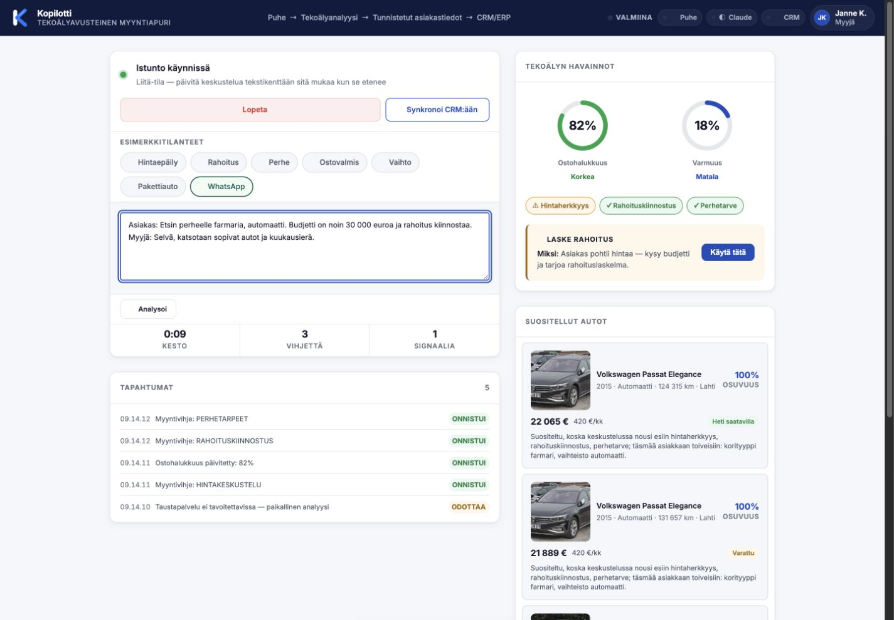

**Suomi** | [English](README.en.md)

# Kopilotti — tekoälyavusteinen myyntiapuri autokauppaan

Kopilotti on julkinen konseptidemo myyjän reaaliaikaisesta päätöksenteon tuesta. Se tunnistaa asiakaskeskustelusta ostosignaaleja, nostaa esiin seuraavia toimenpiteitä ja yhdistää asiakkaan tarpeet demovaraston autoihin.

## [🚀 Kokeile julkista demoa](https://kopilotti-demo.vercel.app/)

> **Nykyinen julkinen tila:** käyttöliittymä on julkaistu Vercelissä ja taustapalvelu Renderissä. Maksullinen Anthropic-analyysi on tarkoituksella pois käytöstä (`ANALYSIS_ENABLED=false`). Kun mallianalyysi ei ole käytettävissä, selain kertoo siitä näkyvästi ja käyttää paikallista sääntöpohjaista arviota.

> **Julkisen repon raja:** tämä repositorio sisältää konseptidemon käyttöliittymän, turvallisen analyysisopimuksen, paikallisen arvioinnin ja synteettisen demodatan. Se ei sisällä Kopilotti Salesin yksityistä päätösmoottoria, jälleenmyyjäkohtaisia liiketoimintasääntöjä, tuotantotunnuksia eikä oikeita CRM-/ERP-integraatioita.

[](https://kopilotti-demo.vercel.app/)

## Miksi Kopilotti on tehty

Kopilotti perustuu yli 20 vuoden kokemukseen autokaupasta. Suurten autotalojen varastoissa voi olla tuhansia ajoneuvoja useissa toimipisteissä, eikä myyjä voi muistaa koko valikoimaa tai yhdistää sitä asiakkaan tarpeisiin kesken jokaisen puhelun tai viestikeskustelun.

Samalla myynnin onnistuminen riippuu auton lisäksi oikea-aikaisista palveluista, kuten rahoituksesta, vakuutuksista ja huolenpitosopimuksista. Kopilotin tavoite on auttaa myyjää tunnistamaan asiakkaan tilanne ja seuraava hyödyllinen toimenpide — ei korvata myyjää tai tehdä kaupallisia päätöksiä hänen puolestaan.

## Mitä julkinen demo näyttää

- Asiakkaan nimenomaisen suostumuksen ennen keskustelun analysointia
- Puheen sekä liitetyn tai kirjoitetun tekstikeskustelun käsittelyn
- Ostosignaalit, ostohalukkuuden, varmuuden ja tilannekohtaiset myyntivihjeet
- Sääntöpohjaisen haun 375 ajoneuvon synteettisestä demovarastosta
- CRM-yhteenvedon ja integraation tapahtumat demotilassa ilman oikeita ulkoisia kirjoituksia
- Rekisterihaun turvallisella esimerkkidatalla (`ABC-123`)

## Nykyinen toteutustila

| Osa | Nykytila |
| --- | --- |
| Käyttöliittymä | Julkaistu Vercelissä, suomenkielinen ja responsiivinen |
| Taustapalvelu | Renderissä; `/health` ja demoajoneuvon rekisterihaku käytettävissä |
| Anthropic-analyysi | Tarkoituksella pois käytöstä; julkinen blueprint ei sisällä API-avainta |
| Paikallinen arvio | Käytössä näkyvänä fallbackina, kun mallianalyysi ei ole saatavilla |
| CRM/ERP | Käyttöliittymä- ja tapahtumademo, ei oikeaa tuotantointegraatiota |
| Tietojen säilytys | Selainistuntokohtainen; demo ei muodosta pysyvää tai ulkopuolisesti todennettavaa audit-lokia |

## Toimintaperiaate

```text
Puhe tai kirjoitettu keskustelu
→ suostumusportti
→ tekoälyanalyysi tai paikallinen sääntöpohjainen arvio
→ tunnistetut asiakastiedot ja ostosignaalit
→ autosuositukset, myyntivihjeet ja demon CRM-tapahtumat
```

Taustapalvelun analyysipyyntö ja mallivastaus validoidaan Zod-skeemoilla. Mallituloksia, käyttäjän tekstiä ja ajoneuvodataa käsitellään käyttöliittymässä turvallisilla DOM-rajapinnoilla ilman epäluotettavan HTML:n suorittamista.

## Turvallisuus- ja tietosuojarajat

- Keskustelua ei voi analysoida ennen asiakkaan nimenomaista hyväksyntää.
- Kieltäytyminen estää session, automaattisen analyysin ja taustapalvelukutsun.
- Ääntä ei tallenneta; selaimen puheentunnistuksen saatavuus riippuu selaimesta.
- Istuntokohtainen suostumusloki elää vain avoimessa selainvälilehdessä.
- Julkinen demo ei kirjoita oikeaan CRM-, ERP- tai WhatsApp-järjestelmään.
- Ajoneuvot, henkilöt, keskustelut ja integraatiotapahtumat ovat demodataa.
- CORS-rajaus ja prosessikohtainen nopeusrajoitin pienentävät väärinkäytön riskiä, mutta eivät korvaa tunnistautumista.

## Teknologiat

Vanilla JavaScript · Web Speech API · Node.js 22.23.2 · Express · Server-Sent Events · Zod · Vitest · Vercel · Render

## Kokeile demoa

1. Avaa [julkinen demo](https://kopilotti-demo.vercel.app/).
2. Paina **✓ Asiakas hyväksyi**. Toiminnot pysyvät lukittuina ilman suostumusta.
3. Valitse **Rahoitus**, **Perhe**, **Pakettiauto** tai **WhatsApp**, tai avaa **Liitä keskustelu** ja käytä vain synteettistä demotekstiä.
4. Seuraa **Tekoälyn havainnot** -kortin ostohalukkuutta, varmuutta, signaaleja ja myyntivihjeitä.
5. Tarkista **Suositellut autot** ja perustelut, jotka vastaavat keskustelussa tunnistettuja tarpeita.
6. Paina **Synkronoi CRM:ään** ja avaa **Integraation tapahtumat (JSON)** nähdäksesi demotilan — oikeaa CRM-kirjoitusta ei tehdä.
7. Kokeile **Rekisterihakua** tunnuksella `ABC-123`.

## Paikallinen kehitys

```bash
npm ci
npm run check:backend
npm test
npm run dev
```

Staattisen käyttöliittymän voi käynnistää erikseen komennolla `npm run dev:static`.

## Tunnetut rajaukset

- Kyseessä on konseptidemo, ei valmis tuotantojärjestelmä.
- Maksullista Anthropic-analyysiä ei ole aktivoitu julkisessa ympäristössä.
- Puheentunnistus ei toimi samalla tavalla kaikissa selaimissa.
- Julkinen analyysipäätepiste on anonyymi; CORS ei ole tunnistautumismenetelmä.
- Nopeusrajoitus on prosessikohtainen, ei instanssien välillä jaettu.
- Oikeat CRM-/ERP-/WhatsApp-integraatiot, tuotannon identiteetinhallinta, pysyvä auditointi sekä hyväksytty tietojen säilytysmalli ovat erillisiä tuotantovaatimuksia.

---

*Tekijä: [Mikko Tarkiainen](https://www.linkedin.com/in/mikko-tarkiainen-accessibility/)*

© 2026 Mikko Tarkiainen. MIT-lisenssi. Katso [LICENSE](LICENSE).
